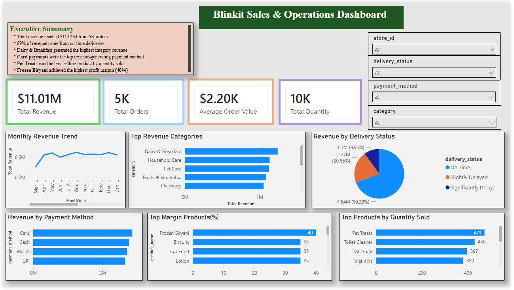

# Blinkit Sales & Operations Dashboard

## Project Overview

This Power BI dashboard analyzes Blinkit's sales and operational performance using order, product, and delivery data.

## Tools Used

- Power BI
- DAX
- Data Modeling
- Data Visualization

## Key KPIs

- Total Revenue: $11.01M
- Total Orders: 5K
- Average Order Value: $2.20K
- Total Quantity Sold: 10K

## Dashboard Features

- Monthly Revenue Trend
- Revenue by Category
- Revenue by Delivery Status
- Revenue by Payment Method
- Top Products by Quantity Sold
- Top Margin Products
- Interactive Filters

## Key Insights

- 69% of revenue came from on-time deliveries.
- Dairy & Breakfast generated the highest category revenue.
- Card payments were the top revenue-generating payment method.
- Pet Treats was the best-selling product.
- Frozen Biryani achieved the highest profit margin (40%).

## Dashboard Preview

## Skills Demonstrated 

- Data Visualization
- Dashboard Design
- KPI Development
- DAX Calculations
- Data Modeling
- Business Performance Analysis
- Power BI
  
## Author

**Prachi Goswami**
Bachelor of Science in Business Analytics
University of Cincinnati
